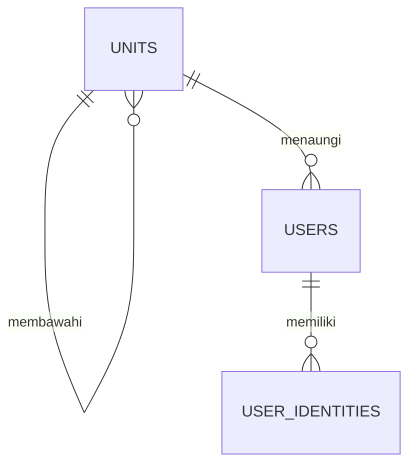
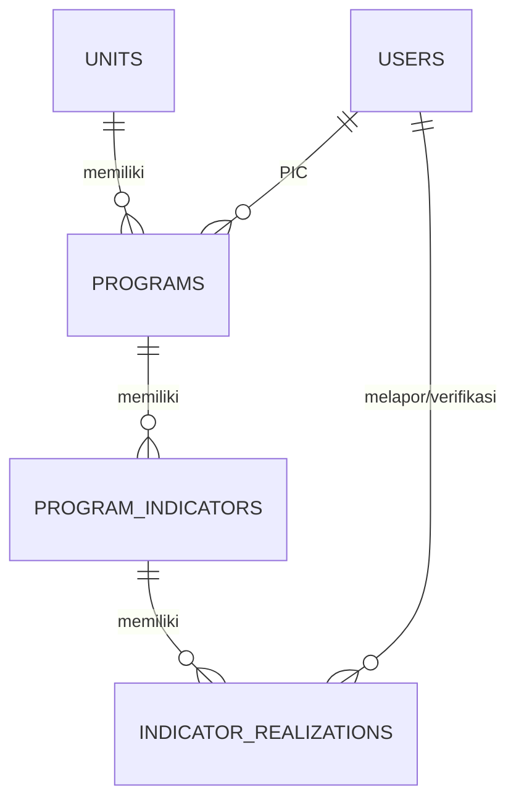
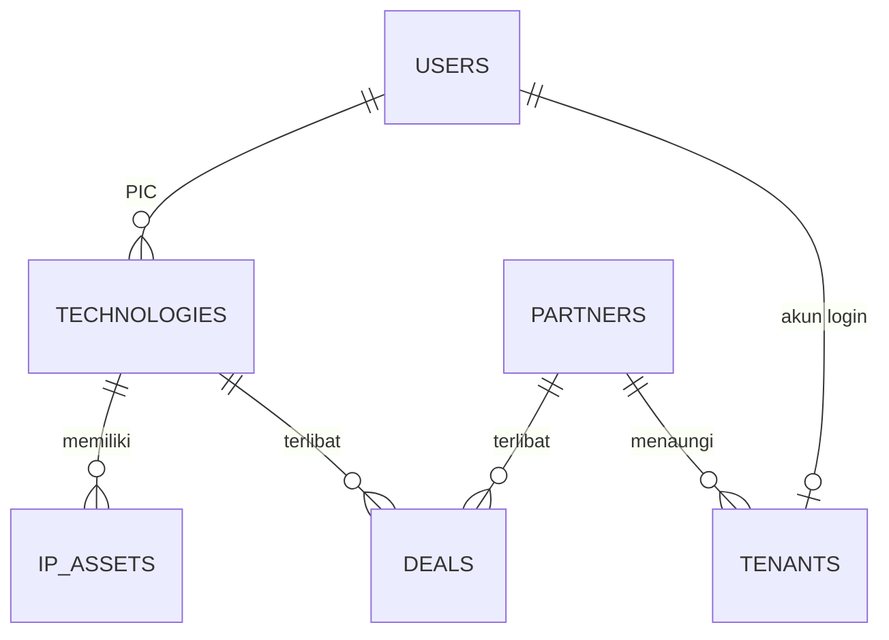
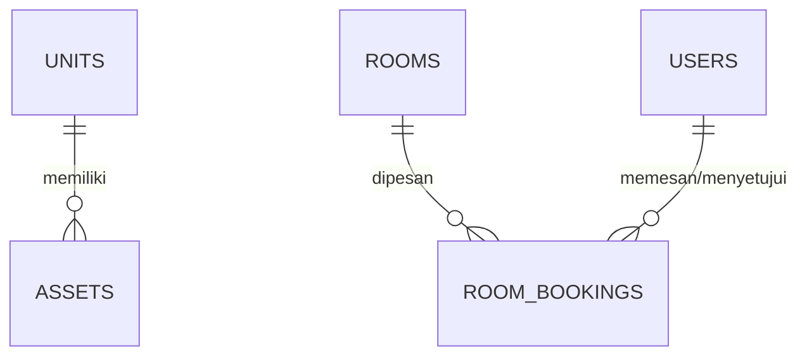
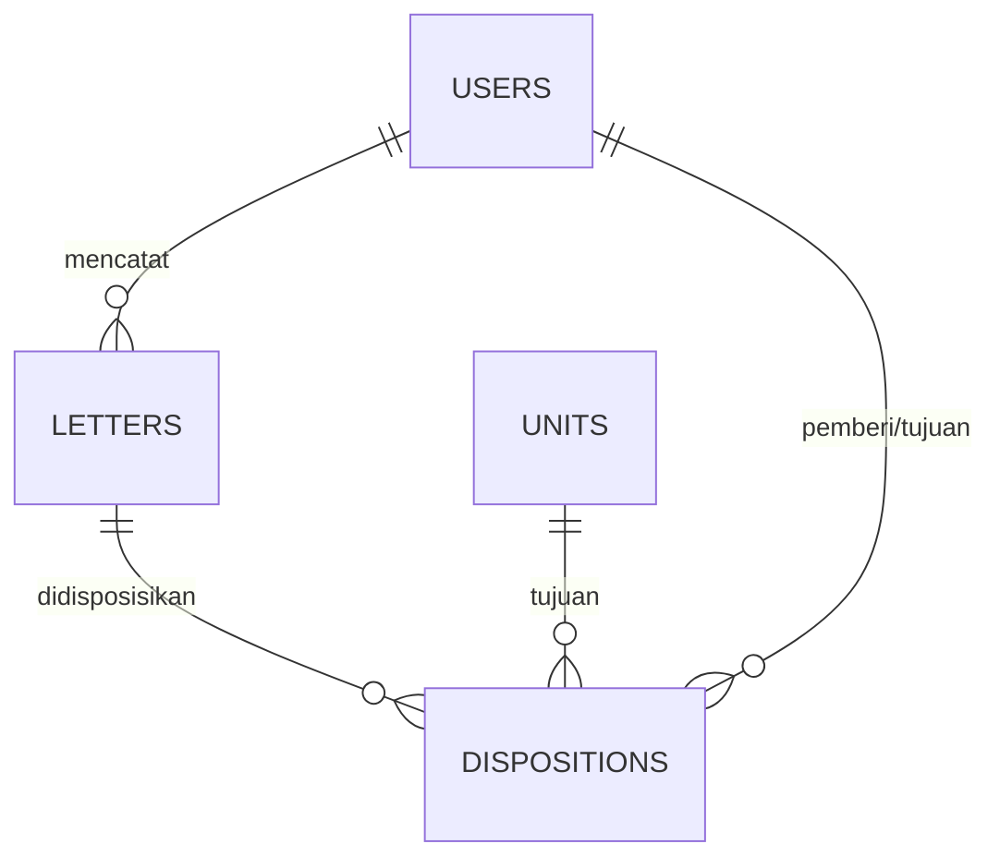
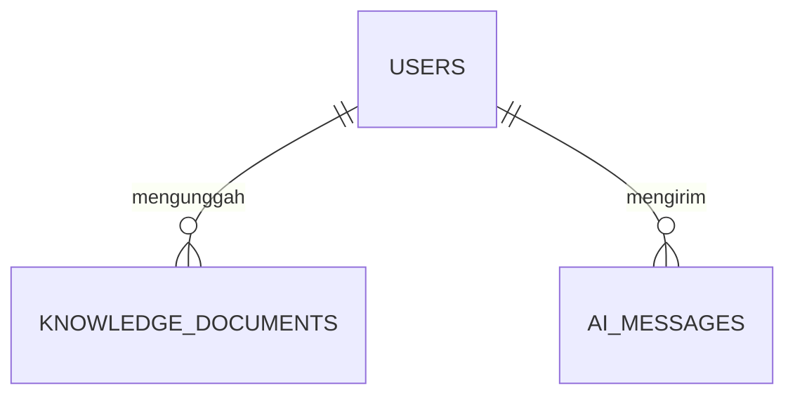
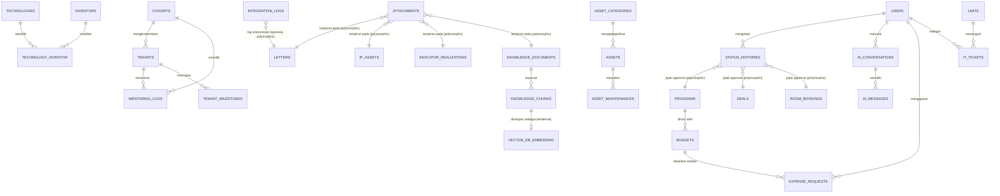

# ERD — DKST Platform (MVP)

Dokumen ini menggambarkan struktur database untuk MVP DKST Platform (Direktorat
Kawasan Sains dan Teknologi ITB), mencakup Modul 1–6. Nama tabel/kolom/relasi
memakai bahasa Inggris; keterangan di sini dan komentar kolom di migration
memakai bahasa Indonesia.

> Tabel `teams`, `team_members`, `team_invitations` (fitur Team bawaan starter
> kit) serta tabel `permissions`, `roles`, `model_has_permissions`,
> `model_has_roles`, `role_has_permissions` (paket spatie/laravel-permission)
> sudah ada sebelumnya/terpasang untuk otorisasi, dan di luar lingkup diagram
> modul DKST di bawah ini.

## 1. Diagram ERD (Mermaid)

```mermaid
erDiagram
    UNITS ||--o{ UNITS : "membawahi (parent_id)"
    UNITS ||--o{ USERS : "menaungi"
    UNITS ||--o{ PROGRAMS : "memiliki"
    UNITS ||--o{ ASSETS : "memiliki"
    UNITS ||--o{ DISPOSITIONS : "menerima (to_unit_id)"

    USERS ||--o{ USER_IDENTITIES : "memiliki"
    USERS ||--o{ PROGRAMS : "PIC (pic_id)"
    USERS ||--o{ TECHNOLOGIES : "PIC (pic_id)"
    USERS ||--o| TENANTS : "akun login (user_id)"
    USERS ||--o{ ROOM_BOOKINGS : "memesan (user_id)"
    USERS ||--o{ ROOM_BOOKINGS : "menyetujui (approved_by)"
    USERS ||--o{ LETTERS : "mencatat (created_by)"
    USERS ||--o{ DISPOSITIONS : "memberi disposisi (from_user_id)"
    USERS ||--o{ DISPOSITIONS : "tujuan disposisi (to_user_id)"
    USERS ||--o{ KNOWLEDGE_DOCUMENTS : "mengunggah (uploaded_by)"
    USERS ||--o{ AI_MESSAGES : "mengirim"
    USERS ||--o{ INDICATOR_REALIZATIONS : "melapor (reported_by)"
    USERS ||--o{ INDICATOR_REALIZATIONS : "memverifikasi (verified_by)"

    PROGRAMS ||--o{ PROGRAM_INDICATORS : "memiliki"
    PROGRAM_INDICATORS ||--o{ INDICATOR_REALIZATIONS : "memiliki"

    TECHNOLOGIES ||--o{ IP_ASSETS : "memiliki"
    TECHNOLOGIES ||--o{ DEALS : "terlibat (technology_id)"
    PARTNERS ||--o{ DEALS : "terlibat (partner_id)"
    PARTNERS ||--o{ TENANTS : "menaungi (partner_id)"

    ROOMS ||--o{ ROOM_BOOKINGS : "dipesan"

    LETTERS ||--o{ DISPOSITIONS : "didisposisikan"

    UNITS {
        bigint id PK
        bigint parent_id FK
        string code UK
        string name
        string type
        timestamp created_at
        timestamp updated_at
    }

    USERS {
        bigint id PK
        bigint unit_id FK
        string name
        string email UK
        string nip UK
        string phone
        boolean is_active
        timestamp last_login_at
        string password
        bigint current_team_id FK
        timestamp created_at
        timestamp updated_at
    }

    USER_IDENTITIES {
        bigint id PK
        bigint user_id FK
        string provider
        string provider_user_id
        string provider_email
        json provider_data
        timestamp linked_at
        timestamp last_login_at
        timestamp created_at
        timestamp updated_at
    }

    PROGRAMS {
        bigint id PK
        bigint unit_id FK
        bigint pic_id FK
        string code UK
        string name
        text description
        smallint year
        decimal budget
        date start_date
        date end_date
        string status
        timestamp created_at
        timestamp updated_at
        timestamp deleted_at
    }

    PROGRAM_INDICATORS {
        bigint id PK
        bigint program_id FK
        string name
        boolean is_iku
        string iku_code
        decimal target
        string measurement_unit
        timestamp created_at
        timestamp updated_at
    }

    INDICATOR_REALIZATIONS {
        bigint id PK
        bigint indicator_id FK
        string period
        decimal actual_value
        text notes
        string evidence_path
        bigint reported_by FK
        bigint verified_by FK
        string status
        timestamp verified_at
        timestamp created_at
        timestamp updated_at
    }

    PARTNERS {
        bigint id PK
        string name
        string type
        string sector
        string address
        string contact_person
        string email
        string phone
        timestamp created_at
        timestamp updated_at
        timestamp deleted_at
    }

    TECHNOLOGIES {
        bigint id PK
        string code UK
        string title
        text description
        string sector
        string faculty
        text inventors
        tinyint trl
        string commercialization_status
        bigint pic_id FK
        timestamp created_at
        timestamp updated_at
        timestamp deleted_at
    }

    IP_ASSETS {
        bigint id PK
        bigint technology_id FK
        string type
        string title
        string application_number
        string certificate_number
        date filing_date
        date issue_date
        string status
        timestamp created_at
        timestamp updated_at
    }

    DEALS {
        bigint id PK
        bigint technology_id FK
        bigint partner_id FK
        string type
        decimal value
        date start_date
        date end_date
        string status
        timestamp created_at
        timestamp updated_at
        timestamp deleted_at
    }

    TENANTS {
        bigint id PK
        bigint partner_id FK
        bigint user_id FK
        string startup_name
        string founder
        string sector
        string cohort
        smallint year
        string stage
        string status
        text progress_notes
        timestamp created_at
        timestamp updated_at
        timestamp deleted_at
    }

    ASSETS {
        bigint id PK
        bigint unit_id FK
        string asset_code UK
        string name
        string category
        string location
        string condition
        date acquisition_date
        decimal acquisition_value
        string status
        timestamp created_at
        timestamp updated_at
        timestamp deleted_at
    }

    ROOMS {
        bigint id PK
        string name
        string building
        smallint capacity
        text facilities
        boolean is_active
        timestamp created_at
        timestamp updated_at
    }

    ROOM_BOOKINGS {
        bigint id PK
        bigint room_id FK
        bigint user_id FK
        date booking_date
        time start_time
        time end_time
        string purpose
        smallint participant_count
        string status
        bigint approved_by FK
        timestamp approved_at
        text approval_notes
        timestamp created_at
        timestamp updated_at
    }

    LETTERS {
        bigint id PK
        string type
        string letter_number
        string agenda_number
        string subject
        string sender
        string recipient
        date letter_date
        date received_date
        string classification
        string file_path
        bigint created_by FK
        string status
        timestamp created_at
        timestamp updated_at
        timestamp deleted_at
    }

    DISPOSITIONS {
        bigint id PK
        bigint letter_id FK
        bigint from_user_id FK
        bigint to_unit_id FK
        bigint to_user_id FK
        text instruction
        date due_date
        string status
        timestamp read_at
        timestamp created_at
        timestamp updated_at
    }

    KNOWLEDGE_DOCUMENTS {
        bigint id PK
        string title
        string category
        string file_path
        longtext content
        bigint uploaded_by FK
        timestamp created_at
        timestamp updated_at
    }

    AI_MESSAGES {
        bigint id PK
        bigint user_id FK
        uuid conversation_id
        string role
        longtext content
        json sources
        timestamp created_at
        timestamp updated_at
    }
```

## 2. Ringkasan per Modul

### Modul 1 — User & Unit

| Tabel                    | Kolom utama                                                                              | Relasi                                                                          | Keterangan                                                                                       |
| ------------------------ | ---------------------------------------------------------------------------------------- | ------------------------------------------------------------------------------- | ------------------------------------------------------------------------------------------------ |
| `units`                  | `code` (UK), `name`, `type`, `parent_id` (FK self)                                       | `parent()`, `children()`, `users()`, `programs()`, `assets()`, `dispositions()` | Struktur unit organisasi DKST berjenjang (induk-anak)                                            |
| `users` _(dimodifikasi)_ | `unit_id` (FK), `nip` (UK), `phone`, `is_active`, `last_login_at`, `password` (nullable) | `unit()`, serta relasi one-to-many ke modul lain                                | Kolom bawaan starter kit diperluas untuk kebutuhan DKST; `password` nullable untuk persiapan SSO |
| `user_identities`        | `user_id` (FK), `provider`, `provider_user_id` (UK bersama)                              | `user()`                                                                        | Identitas SSO ITB per user; kosong selama MVP                                                    |

### Modul 2 — Program & Monev

| Tabel                    | Kolom utama                                                                                     | Relasi                                    | Keterangan                                            |
| ------------------------ | ----------------------------------------------------------------------------------------------- | ----------------------------------------- | ----------------------------------------------------- |
| `programs`               | `unit_id` (FK), `pic_id` (FK), `code` (UK), `year`, `budget`, `status`                          | `unit()`, `pic()`, `indicators()`         | Program kerja DKST per tahun; soft delete             |
| `program_indicators`     | `program_id` (FK), `is_iku`, `iku_code`, `target`, `measurement_unit`                           | `program()`, `realizations()`             | Indikator kinerja program, termasuk IKU               |
| `indicator_realizations` | `indicator_id` (FK), `period`, `actual_value`, `reported_by` (FK), `verified_by` (FK), `status` | `indicator()`, `reporter()`, `verifier()` | Realisasi indikator per periode beserta verifikasinya |

### Modul 3 — Mitra, Teknologi & KI, Inkubasi

| Tabel          | Kolom utama                                                                        | Relasi                           | Keterangan                                                       |
| -------------- | ---------------------------------------------------------------------------------- | -------------------------------- | ---------------------------------------------------------------- |
| `partners`     | `name`, `type`, `sector`                                                           | `deals()`, `tenants()`           | Mitra kerja sama (industri, pemerintah, dll); soft delete        |
| `technologies` | `code` (UK), `title`, `trl`, `commercialization_status`, `pic_id` (FK)             | `pic()`, `ipAssets()`, `deals()` | Teknologi hasil riset; soft delete                               |
| `ip_assets`    | `technology_id` (FK), `type`, `application_number`, `certificate_number`, `status` | `technology()`                   | Aset kekayaan intelektual (paten, hak cipta, dll) atas teknologi |
| `deals`        | `technology_id` (FK, nullable), `partner_id` (FK), `type`, `value`, `status`       | `technology()`, `partner()`      | Transaksi lisensi/kerja sama/spin off; soft delete               |
| `tenants`      | `partner_id` (FK), `user_id` (FK), `startup_name`, `stage`, `status`               | `partner()`, `user()`            | Startup yang menjalani inkubasi/akselerasi; soft delete          |

### Modul 4 — Aset & Ruangan

| Tabel           | Kolom utama                                                                                            | Relasi                           | Keterangan                                                              |
| --------------- | ------------------------------------------------------------------------------------------------------ | -------------------------------- | ----------------------------------------------------------------------- |
| `assets`        | `unit_id` (FK), `asset_code` (UK), `condition`, `status`                                               | `unit()`                         | Inventaris aset milik DKST; soft delete                                 |
| `rooms`         | `name`, `building`, `capacity`, `is_active`                                                            | `bookings()`                     | Ruangan yang dapat dipesan                                              |
| `room_bookings` | `room_id` (FK), `user_id` (FK), `booking_date`, `start_time`, `end_time`, `status`, `approved_by` (FK) | `room()`, `user()`, `approver()` | Pemesanan ruangan; `RoomBooking::hasConflict()` mengecek bentrok jadwal |

### Modul 5 — Surat & Disposisi

| Tabel          | Kolom utama                                                                                     | Relasi                                           | Keterangan                                  |
| -------------- | ----------------------------------------------------------------------------------------------- | ------------------------------------------------ | ------------------------------------------- |
| `letters`      | `type`, `letter_number`, `classification`, `created_by` (FK), `status`                          | `creator()`, `dispositions()`                    | Surat masuk/keluar DKST; soft delete        |
| `dispositions` | `letter_id` (FK), `from_user_id` (FK), `to_unit_id` (FK), `to_user_id` (FK, nullable), `status` | `letter()`, `fromUser()`, `toUnit()`, `toUser()` | Alur disposisi surat ke unit/pejabat tujuan |

### Modul 6 — AI Assistant

| Tabel                 | Kolom utama                                                            | Relasi       | Keterangan                                                                                             |
| --------------------- | ---------------------------------------------------------------------- | ------------ | ------------------------------------------------------------------------------------------------------ |
| `knowledge_documents` | `title`, `category`, `content`, `uploaded_by` (FK)                     | `uploader()` | Basis pengetahuan (SOP/regulasi/panduan); `scopeSearch()` pakai full-text index pada `title`+`content` |
| `ai_messages`         | `user_id` (FK), `conversation_id` (uuid), `role`, `content`, `sources` | `user()`     | Riwayat percakapan AI assistant per user                                                               |

## 3. Daftar Nilai Status per Tabel

| Tabel                    | Kolom                      | Nilai valid                                                           | Arti                                               |
| ------------------------ | -------------------------- | --------------------------------------------------------------------- | -------------------------------------------------- |
| `units`                  | `type`                     | `directorate`, `secretariat`, `deputy`, `sub_directorate`, `external` | direktorat, sekretariat, deputi, subdit, eksternal |
| `programs`               | `status`                   | `draft`, `ongoing`, `completed`                                       | draft, berjalan, selesai                           |
| `indicator_realizations` | `status`                   | `submitted`, `verified`, `rejected`                                   | diajukan, diverifikasi, ditolak                    |
| `partners`               | `type`                     | `industry`, `startup`, `government`, `other`                          | industri, startup, pemerintah, lainnya             |
| `technologies`           | `commercialization_status` | `research`, `ready_to_license`, `licensed`, `spin_off`                | riset, siap lisensi, dilisensikan, spin off        |
| `ip_assets`              | `type`                     | `patent`, `copyright`, `trademark`, `industrial_design`               | paten, hak cipta, merek, desain industri           |
| `ip_assets`              | `status`                   | `draft`, `submitted`, `registered`, `granted`, `rejected`             | draft, diajukan, terdaftar, granted, ditolak       |
| `deals`                  | `type`                     | `license`, `collaboration`, `spin_off`                                | lisensi, kerja sama, spin off                      |
| `deals`                  | `status`                   | `negotiation`, `active`, `completed`, `cancelled`                     | negosiasi, aktif, selesai, batal                   |
| `tenants`                | `stage`                    | `pre_incubation`, `incubation`, `acceleration`                        | pra inkubasi, inkubasi, akselerasi                 |
| `tenants`                | `status`                   | `active`, `graduated`, `withdrawn`                                    | aktif, lulus, keluar                               |
| `assets`                 | `condition`                | `good`, `minor_damage`, `major_damage`                                | baik, rusak ringan, rusak berat                    |
| `assets`                 | `status`                   | `active`, `borrowed`, `disposed`                                      | aktif, dipinjam, dihapus                           |
| `room_bookings`          | `status`                   | `pending`, `approved`, `rejected`                                     | diajukan, disetujui, ditolak                       |
| `letters`                | `type`                     | `incoming`, `outgoing`                                                | masuk, keluar                                      |
| `letters`                | `classification`           | `regular`, `important`, `confidential`                                | biasa, penting, rahasia                            |
| `letters`                | `status`                   | `new`, `forwarded`, `completed`                                       | baru, didisposisi, selesai                         |
| `dispositions`           | `status`                   | `new`, `read`, `in_progress`, `completed`                             | baru, dibaca, diproses, selesai                    |
| `knowledge_documents`    | `category`                 | `sop`, `regulation`, `guide`                                          | sop, regulasi, panduan                             |
| `ai_messages`            | `role`                     | `user`, `assistant`                                                   | pesan user, pesan AI assistant                     |

## 4. Gambaran Besar per Modul

Diagram ringkas berikut hanya menampilkan nama tabel dan relasinya (tanpa daftar
kolom), untuk memahami alur antar tabel per modul secara cepat. Detail kolom
ada di diagram penuh pada bagian 1.

### Modul 1 — User & Unit

### Modul 2 — Program & Monev

### Modul 3 — Mitra, Teknologi & KI, Inkubasi

### Modul 4 — Aset & Ruangan

### Modul 5 — Surat & Disposisi

### Modul 6 — AI Assistant

## 5. Roadmap Pasca-MVP

Bagian ini **hanya dokumentasi perencanaan**, belum ada migration-nya. Tabel di
bawah adalah kandidat perluasan setelah MVP berjalan, untuk mengganti kolom
teks sederhana dengan struktur relasional, atau menambah modul baru.

| Tabel usulan                                                      | Menggantikan/Memperluas                                                                                                                          | Alasan                                                                                                                                                                               |
| ----------------------------------------------------------------- | ------------------------------------------------------------------------------------------------------------------------------------------------ | ------------------------------------------------------------------------------------------------------------------------------------------------------------------------------------ |
| `inventors`, `technology_inventor` (pivot)                        | `technologies.inventors` (teks, dipisah koma)                                                                                                    | Data inventor jadi entitas sendiri (bisa dicari, dihubungkan ke beberapa teknologi, dilengkapi profil) alih-alih teks bebas yang rapuh untuk parsing                                 |
| `cohorts`, `mentoring_logs`, `tenant_milestones`                  | `tenants.cohort` (teks)                                                                                                                          | Cohort jadi entitas dengan periode & kapasitas sendiri; mentoring dan milestone butuh riwayat per tenant yang tidak bisa ditampung satu kolom teks                                   |
| `asset_categories`, `asset_maintenances`                          | `assets.category` (teks)                                                                                                                         | Kategori aset perlu konsisten (bukan teks bebas) dan aset perlu riwayat perawatan/servis, bukan hanya kondisi terakhir                                                               |
| `attachments` (polymorphic)                                       | Kolom `*_path` di berbagai tabel (`letters.file_path`, `ip_assets` dsb, `indicator_realizations.evidence_path`, `knowledge_documents.file_path`) | Satu model lampiran generik mendukung multi-file per record, metadata (ukuran, tipe), dan riwayat unggahan, dibanding satu kolom path per tabel                                      |
| `status_histories` (polymorphic)                                  | — (baru, jejak audit)                                                                                                                            | Banyak tabel (`programs`, `deals`, `room_bookings`, dll) hanya simpan status terakhir; perlu jejak siapa mengubah status apa, kapan, dan catatannya untuk audit/approval             |
| `ai_conversations`, `knowledge_chunks` (+ embedding di vector DB) | Memperluas `ai_messages.conversation_id` (uuid lepas) dan `knowledge_documents.content` (teks utuh)                                              | Percakapan butuh metadata sendiri (judul, waktu mulai); dokumen panjang perlu dipecah jadi chunk dengan embedding vektor untuk pencarian semantik (RAG), bukan hanya full-text MySQL |
| `integration_logs`                                                | — (baru)                                                                                                                                         | Mencatat riwayat kirim/terima data ke sistem eksternal (SATUDATA, SIRENDU, Oracle Fusion) untuk audit dan debugging integrasi                                                        |
| `budgets`, `expense_requests`                                     | — (modul Finance baru)                                                                                                                           | Anggaran program (`programs.budget`) perlu dirinci per pos, dan pengajuan pencairan perlu alur sendiri yang bersumber/tersinkron dari Oracle Fusion                                  |
| `it_tickets`                                                      | — (modul IT Services/helpdesk baru)                                                                                                              | Belum ada tempat mencatat laporan gangguan/permintaan layanan IT dari user                                                                                                           |
